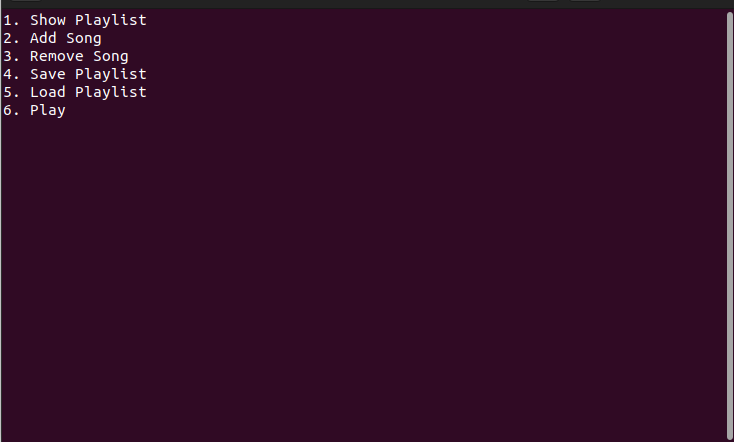
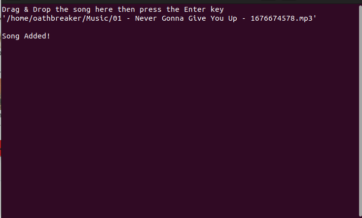
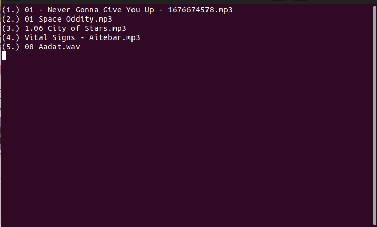
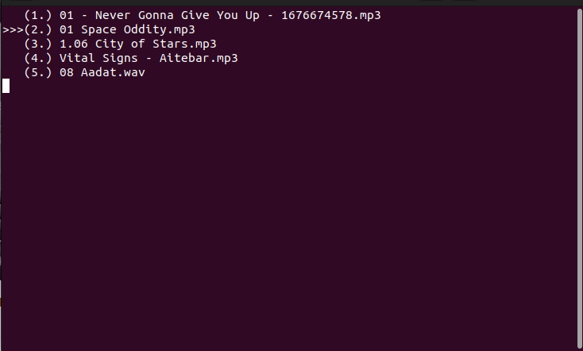

# MonkePlayer

A minimalist command-line music player using SDL/SDL_mixer and ncurses. Developed just for fun.

### Dependencies:

SDL/SDL_mixer

ncurses

### Use Cases:

Drag & Drop the song you want to play.

Create, View, Play, Save, Load your own playlist.

Add or Delete any song from the playlist.

### Usage:

Follow along the menu.

When in `Play` mode:

Press `spacebar` to pause or play.

Press `n` to play the next song in the list.

Press `p` to play the previous song in the list.

Press `0` or `9` to increase or decrease volume respectively.

### Compiling

SDL and SDL_mixer libraries as well as the ncurses library is required to be installed for compilation.

Make sure to link the libraries when compiling:

`g++ MonkePlayer.cpp Song.cpp -o MonkePlayer -lncurses -lSDL -lSDL_mixer`

### Visuals

> Main Menu

> Add Song

> View Playlist

> Play
